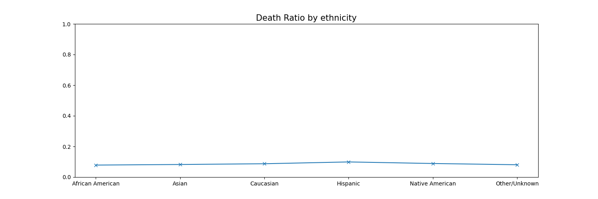
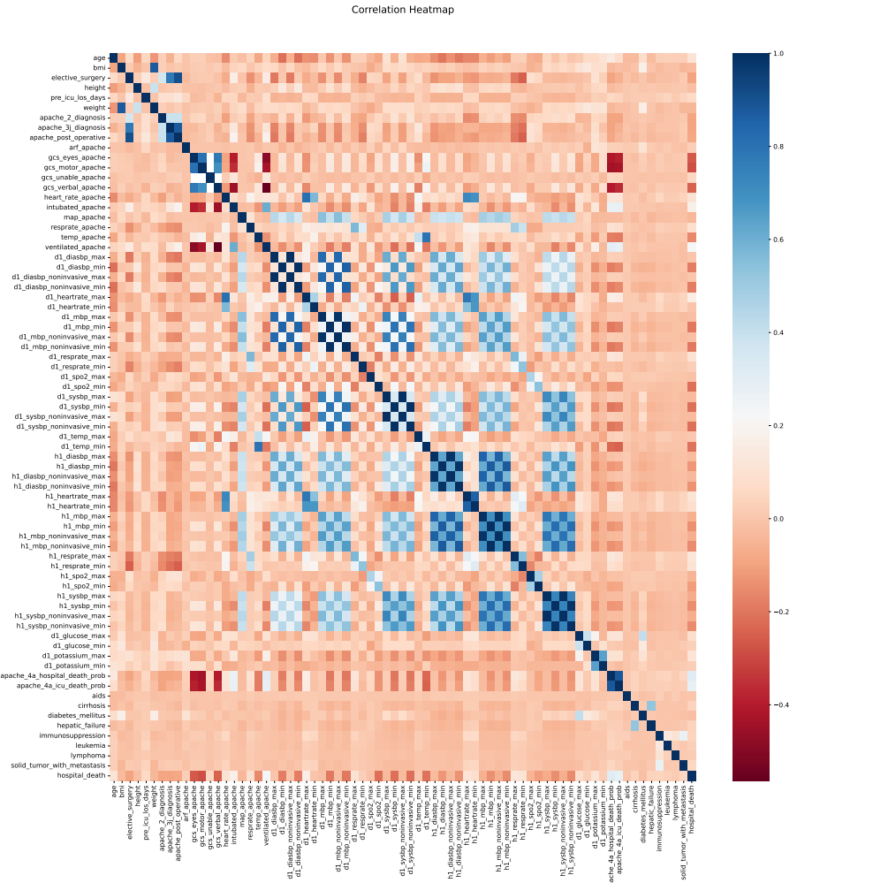

# AI-X_DeepLearning_2022Fall_FinalProject
## Title
**Exploring Survival in the Hospital**(입원 중인 환자의 생존률)
<br>블로그 링크: https://github.com/cdh1110/AI-X_DeepLearning_2022
## Members
<br> 차도현, 물리학과, chamena1110@gmail.com <br> Khaliun, 경제금융학부, haliunurgamaltuya@gmail.com 

## Index
####    I. Proposal
####    II. Datasets
####    III. Methodology
####    IV. Evaluation & Analysis
####    V. Related Works
####    VI. Conclusion: Discussion

## I. Proposal (Option A)

- Motivation: <br> 본 수업에서 제공된 타이타닉 예제, Exploring Survivals on Titanic 글은 ML의 기초를 다질 입문 과정으로 적합해 보입니다. 따라서 공부와 연습을 위해 그와 유사한 타입의 주제를 선정하고 싶었습니다. Kaggle과 각종 공공데이터 웹사이트를 이용해 Binary Classification이면서, Feature Engineering, EDA를 연습하기 좋은 데이터를 검색하여 여러 후보들을 추리고 조원과 상의한 결과, 현 주제인 Patient Survival Prediction을 하기로 최종 결정했습니다. 제공된 feature의 종류가 85개에다, 결측치도 간간히 포함되어 있어 보다 팀 프로젝트에 최적인 양으로 보이고, 실재 기반 데이터이며 예측 모델을 성공적으로 구축 시, '사망'을 예방할 수 있다는 실용적인 의미도 있는 것이 그 이유입니다.   

- What do you want to see at the end?: <br> 내적으로는, 입원 중인 환자의 병원 내 사망률에 대한 주 요인을 파악하고, 이에 머신러닝 기반의 예측 모델을 구축하는 것이 목표입니다. <br> 외적으로는 다음의 학습 목표를 통해 EDA와 ML의 기초를 다지는 것입니다. <ol> -약 80여개의 다양한 feature중 중요 feature을 선별 <br> -일부 행에 존재하는 결측치를 합리적으로 처리(단순 삭제 vs 합리적 예측) <br> -머신러닝에 사용되는 알고리즘을 이해하고 실전 데이터에 적용 


## II. Datasets
 
 
 
 
- 데이터는 다음의 kaggle 웹사이트로부터 얻었습니다.
https://www.kaggle.com/datasets/mitishaagarwal/patient 

ICU(중환자실) 입원 환자의 여러 특징과 해당 환자 사망 여부를 나타낸 데이터입니다. 환자가 생존 했을 경우 0, 사망 했을 경우 1입니다. 
*타이타닉 예제와 같은 binary classification입니다. 약 80개나 되는 다양한 feature가 존재하고 중간중간 결측치(Null, NaN) 또한 가지고 있어 EDA에 대부분의 시간이 할애될 것입니다. 따라서 이 두 가지 특징 때문에, 본 프로젝트는 타이타닉 예제와 매우 유사한 방식으로 진행될 것이 예상됩니다. Feature engineering, Missing value imputation, Prediction을 중점으로 다루겠습니다.*
<br>
<br>사용할 언어는 R과 python입니다. 후에 시간을 추가로 활용하여 전과정을 python 통합하겠습니다.
<br>
### II-1. Overview

먼저 데이터 분석에 필요한 패키지들을 불러옵니다.
```R
library('dplyr') #data manipulation
library('tidyr') #data manipulation
library('naniar') #NA manipulation
library('VIM') #visualization
library('ggplot2') #visualization
```
이제 데이터를 로드합니다.
```R
data <- read.csv('./project_data.csv', stringsAsFactors = F, na.strings = c("", " ","  ", NA))
str(data)
```
```
'data.frame':   91713 obs. of  85 variables:
 $ encounter_id                 : int  66154 114252 119783 79267 92056 33181 82208 120995 80471 42871 ...
 $ patient_id                   : int  25312 59342 50777 46918 34377 74489 49526 50129 10577 90749 ...
 $ hospital_id                  : int  118 81 118 118 33 83 83 33 118 118 ...
 $ age                          : int  68 77 25 81 19 67 59 70 45 50 ...
 $ bmi                          : num  22.7 27.4 31.9 22.6 NA ...
 $ elective_surgery             : int  0 0 0 1 0 0 0 0 0 0 ...
 $ ethnicity                    : chr  "Caucasian" "Caucasian" "Caucasian" "Caucasian" ...
 $ gender                       : chr  "M" "F" "F" "F" ...
 $ height                       : num  180 160 173 165 188 ...
 $ icu_admit_source             : chr  "Floor" "Floor" "Accident & Emergency" "Operating Room / Recovery" ...
 $ icu_id                       : int  92 90 93 92 91 95 95 91 114 114 ...
 $ icu_stay_type                : chr  "admit" "admit" "admit" "admit" ...
 $ icu_type                     : chr  "CTICU" "Med-Surg ICU" "Med-Surg ICU" "CTICU" ...
 $ pre_icu_los_days             : num  0.541667 0.927778 0.000694 0.000694 0.073611 ...
 $ weight                       : num  73.9 70.2 95.3 61.7 NA ...
 $ apache_2_diagnosis           : int  113 108 122 203 119 301 108 113 116 112 ...
 $ apache_3j_diagnosis          : num  502 203 703 1206 601 ...
 $ apache_post_operative        : int  0 0 0 1 0 0 0 0 0 0 ...
 $ arf_apache                   : int  0 0 0 0 0 0 0 0 0 0 ...
 $ gcs_eyes_apache              : int  3 1 3 4 NA 4 4 4 4 4 ...
 $ gcs_motor_apache             : int  6 3 6 6 NA 6 6 6 6 6 ...
 $ gcs_unable_apache            : int  0 0 0 0 NA 0 0 0 0 0 ...
 $ gcs_verbal_apache            : int  4 1 5 5 NA 5 5 5 5 5 ...
 $ heart_rate_apache            : int  118 120 102 114 60 113 133 120 82 94 ...
 $ intubated_apache             : int  0 0 0 1 0 0 1 0 0 0 ...
 $ map_apache                   : int  40 46 68 60 103 130 138 60 66 58 ...
 $ resprate_apache              : num  36 33 37 4 16 35 53 28 14 46 ...
 $ temp_apache                  : num  39.3 35.1 36.7 34.8 36.7 36.6 35 36.6 36.9 36.3 ...
 $ ventilated_apache            : int  0 1 0 1 0 0 1 1 1 0 ...
 $ d1_diasbp_max                : int  68 95 88 48 99 100 76 84 65 83 ...
 $ d1_diasbp_min                : int  37 31 48 42 57 61 68 46 59 48 ...
 $ d1_diasbp_noninvasive_max    : int  68 95 88 48 99 100 76 84 65 83 ...
 $ d1_diasbp_noninvasive_min    : int  37 31 48 42 57 61 68 46 59 48 ...
 $ d1_heartrate_max             : int  119 118 96 116 89 113 112 118 82 96 ...
 $ d1_heartrate_min             : int  72 72 68 92 60 83 70 86 82 57 ...
 $ d1_mbp_max                   : int  89 120 102 84 104 127 117 114 93 101 ...
 $ d1_mbp_min                   : int  46 38 68 84 90 80 97 60 71 59 ...
 $ d1_mbp_noninvasive_max       : int  89 120 102 84 104 127 117 114 93 101 ...
 $ d1_mbp_noninvasive_min       : int  46 38 68 84 90 80 97 60 71 59 ...
 $ d1_resprate_max              : int  34 32 21 23 18 32 38 28 24 44 ...
 $ d1_resprate_min              : int  10 12 8 7 16 10 16 12 19 14 ...
 $ d1_spo2_max                  : int  100 100 98 100 100 97 100 100 97 100 ...
 $ d1_spo2_min                  : int  74 70 91 95 96 91 87 92 97 96 ...
 $ d1_sysbp_max                 : int  131 159 148 158 147 173 151 147 104 135 ...
 $ d1_sysbp_min                 : int  73 67 105 84 120 107 133 71 98 78 ...
 $ d1_sysbp_noninvasive_max     : int  131 159 148 158 147 173 151 147 104 135 ...
 $ d1_sysbp_noninvasive_min     : num  73 67 105 84 120 107 133 71 98 78 ...
 $ d1_temp_max                  : num  39.9 36.3 37 38 37.2 36.8 37.2 38.5 36.9 37.1 ...
 $ d1_temp_min                  : num  37.2 35.1 36.7 34.8 36.7 36.6 35 36.6 36.9 36.4 ...
 $ h1_diasbp_max                : int  68 61 88 62 99 89 107 74 65 83 ...
 $ h1_diasbp_min                : int  63 48 58 44 68 89 79 55 59 61 ...
 $ h1_diasbp_noninvasive_max    : int  68 61 88 NA 99 89 NA 74 65 83 ...
 $ h1_diasbp_noninvasive_min    : int  63 48 58 NA 68 89 NA 55 59 61 ...
 $ h1_heartrate_max             : int  119 114 96 100 89 83 79 118 82 96 ...
 $ h1_heartrate_min             : int  108 100 78 96 76 83 72 114 82 60 ...
 $ h1_mbp_max                   : int  86 85 91 92 104 111 117 88 93 101 ...
 $ h1_mbp_min                   : int  85 57 83 71 92 111 117 60 71 77 ...
 $ h1_mbp_noninvasive_max       : int  86 85 91 NA 104 111 117 88 93 101 ...
 $ h1_mbp_noninvasive_min       : int  85 57 83 NA 92 111 117 60 71 77 ...
 $ h1_resprate_max              : int  26 31 20 12 NA 12 18 28 24 29 ...
 $ h1_resprate_min              : int  18 28 16 11 NA 12 18 26 19 17 ...
 $ h1_spo2_max                  : int  100 95 98 100 100 97 100 96 97 100 ...
 $ h1_spo2_min                  : int  74 70 91 99 100 97 100 92 97 96 ...
 $ h1_sysbp_max                 : int  131 95 148 136 130 143 191 119 104 135 ...
 $ h1_sysbp_min                 : int  115 71 124 106 120 143 163 106 98 103 ...
 $ h1_sysbp_noninvasive_max     : int  131 95 148 NA 130 143 NA 119 104 135 ...
 $ h1_sysbp_noninvasive_min     : int  115 71 124 NA 120 143 NA 106 98 103 ...
 $ d1_glucose_max               : int  168 145 NA 185 NA 156 197 129 365 134 ...
 $ d1_glucose_min               : int  109 128 NA 88 NA 125 129 129 288 134 ...
 $ d1_potassium_max             : num  4 4.2 NA 5 NA 3.9 5 5.8 5.2 4.1 ...
 $ d1_potassium_min             : num  3.4 3.8 NA 3.5 NA 3.7 4.2 2.4 5.2 3.3 ...
 $ apache_4a_hospital_death_prob: num  0.1 0.47 0 0.04 NA 0.05 0.1 0.11 NA 0.02 ...
 $ apache_4a_icu_death_prob     : num  0.05 0.29 0 0.03 NA 0.02 0.05 0.06 NA 0.01 ...
 $ aids                         : int  0 0 0 0 0 0 0 0 0 0 ...
 $ cirrhosis                    : int  0 0 0 0 0 0 0 0 0 0 ...
 $ diabetes_mellitus            : int  1 1 0 0 0 1 1 0 0 0 ...
 $ hepatic_failure              : int  0 0 0 0 0 0 0 0 0 0 ...
 $ immunosuppression            : int  0 0 0 0 0 0 0 1 0 0 ...
 $ leukemia                     : int  0 0 0 0 0 0 0 0 0 0 ...
 $ lymphoma                     : int  0 0 0 0 0 0 0 0 0 0 ...
 $ solid_tumor_with_metastasis  : int  0 0 0 0 0 0 0 0 0 0 ...
 $ apache_3j_bodysystem         : chr  "Sepsis" "Respiratory" "Metabolic" "Cardiovascular" ...
 $ apache_2_bodysystem          : chr  "Cardiovascular" "Respiratory" "Metabolic" "Cardiovascular" ...
 $ X                            : logi  NA NA NA NA NA NA ...
 $ hospital_death               : int  0 0 0 0 0 0 0 0 1 0 ...
        
```    
총 **91713명**의 환자에 대한 **85개**의 변수를 확인할 수 있습니다.<br>각 변수에 대한 설명을 간략히 아래 표로 정리했습니다. (자세한 설명은 섹션 III에 이어서 합니다.)
        
| 변수 이름 | 설명 |
| ------------- | ------------- |
| encounter_id   | 입원과 관련된 ID  |
| patient_id    | 환자 ID  |                    
|hospital_id| 병원 ID  |
|age| 나이  |                        
|bmi| 체질량지수  |                           
|elective_surgery| 선택적 수술 동의(1), 거부(0) |
|ethnicity| 인종  |
|gender| 성별  |
|height| 키  |
|weight| 체중 | 
|icu_~| 집중치료실(ICU) 관련 데이터  |
|apache_2_...| 의학적 점수인 APACHE II와 관련된 데이터 |  
|apache_3_...| 의학적 점수인 APACHE III와 관련된 데이터 | 
|apache_4_...| 의학적 점수인 APACHE IV와 관련된 데이터 |  
|apache_post_operative| 수술 받음(1), 받지 않음(0) |
|gcs_~| 글래스고 혼수척도 관련 데이터 |          
|d1_heartrate_max/min| 최고/최저 심박수(24h) |
|...| ...  |
|h1_heartrate_max/min| 최고/최저 심박수(1h) |
|...| ...  |       
|aids/cirrhosis/...| 에이즈/경화증/... 관련 병력(1), 이상없음(0) |        
| soliol_tumor_with_metastasis | 전이 종양 진단(1) 해당없음 (0) |
|...| ... |
|**hospital_death**| **사망(1), 생존(0)**  |   

### II-2. Check Missing Values        
데이터의 결측치를 확인합니다.
   <code>is.na()</code>를 이용해서 결측치를 간단히 확인하는 것도 좋지만,
```R
df_null <- data.frame(colSums(is.na(data)))        
head(df_null)
```
```
                 colSums.is.na.data..
encounter_id                        0
patient_id                          0
hospital_id                         0
age                              4228
bmi                              3429
elective_surgery                    0
```        
<code>naniar</code> 패키지를 사용해 결측치를 좀 더 체계적으로 확인합니다.
```R
print(naniar::miss_var_summary(data),n=85)
```        
```        
# A tibble: 85 × 3
   variable                      n_miss pct_miss
   <chr>                          <int>    <dbl>
 1 X                              91713 100     
 2 d1_potassium_max                9585  10.5   
 3 d1_potassium_min                9585  10.5   
 4 h1_mbp_noninvasive_max          9084   9.90  
 5 h1_mbp_noninvasive_min          9084   9.90  
 6 apache_4a_hospital_death_prob   7947   8.67  
 7 apache_4a_icu_death_prob        7947   8.67  
 8 h1_diasbp_noninvasive_max       7350   8.01  
 9 h1_diasbp_noninvasive_min       7350   8.01  
10 h1_sysbp_noninvasive_max        7341   8.00  
11 h1_sysbp_noninvasive_min        7341   8.00  
12 d1_glucose_max                  5807   6.33  
13 d1_glucose_min                  5807   6.33  
14 h1_mbp_max                      4639   5.06  
15 h1_mbp_min                      4639   5.06  
16 h1_resprate_max                 4357   4.75  
17 h1_resprate_min                 4357   4.75  
18 age                             4228   4.61  
19 h1_spo2_max                     4185   4.56  
20 h1_spo2_min                     4185   4.56  
21 temp_apache                     4108   4.48  
22 h1_diasbp_max                   3619   3.95  
23 h1_diasbp_min                   3619   3.95  
24 h1_sysbp_max                    3611   3.94  
25 h1_sysbp_min                    3611   3.94  
26 bmi                             3429   3.74  
27 h1_heartrate_max                2790   3.04  
28 h1_heartrate_min                2790   3.04  
29 weight                          2720   2.97  
30 d1_temp_max                     2324   2.53  
31 d1_temp_min                     2324   2.53  
32 gcs_eyes_apache                 1901   2.07  
33 gcs_motor_apache                1901   2.07  
34 gcs_verbal_apache               1901   2.07  
35 apache_2_diagnosis              1662   1.81  
36 apache_3j_bodysystem            1662   1.81  
37 apache_2_bodysystem             1662   1.81  
38 d1_mbp_noninvasive_max          1479   1.61  
39 d1_mbp_noninvasive_min          1479   1.61  
40 ethnicity                       1395   1.52  
41 height                          1334   1.45  
42 resprate_apache                 1234   1.35  
43 apache_3j_diagnosis             1101   1.20  
44 d1_diasbp_noninvasive_max       1040   1.13  
45 d1_diasbp_noninvasive_min       1040   1.13  
46 gcs_unable_apache               1037   1.13  
47 d1_sysbp_noninvasive_max        1027   1.12  
48 d1_sysbp_noninvasive_min        1027   1.12  
49 map_apache                       994   1.08  
50 heart_rate_apache                878   0.957 
51 arf_apache                       715   0.780 
52 intubated_apache                 715   0.780 
53 ventilated_apache                715   0.780 
54 aids                             715   0.780 
55 cirrhosis                        715   0.780 
56 diabetes_mellitus                715   0.780 
57 hepatic_failure                  715   0.780 
58 immunosuppression                715   0.780 
59 leukemia                         715   0.780 
60 lymphoma                         715   0.780 
61 solid_tumor_with_metastasis      715   0.780 
62 d1_resprate_max                  385   0.420 
63 d1_resprate_min                  385   0.420 
64 d1_spo2_max                      333   0.363 
65 d1_spo2_min                      333   0.363 
66 d1_mbp_max                       220   0.240 
67 d1_mbp_min                       220   0.240 
68 d1_diasbp_max                    165   0.180 
69 d1_diasbp_min                    165   0.180 
70 d1_sysbp_max                     159   0.173 
71 d1_sysbp_min                     159   0.173 
72 d1_heartrate_max                 145   0.158 
73 d1_heartrate_min                 145   0.158 
74 icu_admit_source                 112   0.122 
75 gender                            25   0.0273
76 encounter_id                       0   0     
77 patient_id                         0   0     
78 hospital_id                        0   0     
79 elective_surgery                   0   0     
80 icu_id                             0   0     
81 icu_stay_type                      0   0     
82 icu_type                           0   0     
83 pre_icu_los_days                   0   0     
84 apache_post_operative              0   0     
85 hospital_death                     0   0 
``` 
결측치 개수에 따라 내림차순으로 정리한 결과를 얻었습니다. 각 3개의 열은 변수의 이름, 결측치, 결측 퍼센티지를 나타냅니다. 

### II-3. Analysis of Missing Values   

위 tibble 프레임의 첫 줄을 살펴보면, "X" 열의 결측값이 91713개로, 100% 비율의 결측을 가지고 있습니다. <br>열 이름에서 유추할 수 있듯 *아무런 의미가 없는* 열이기 때문에 "X" 열은 **삭제**합니다.
```R  
data <- subset(data, select=-c(X))
```
다시 간략히 확인해보면,
```R  
naniar::miss_var_summary(data)
```
```
# A tibble: 84 × 3
   variable                      n_miss pct_miss
   <chr>                          <int>    <dbl>
 1 d1_potassium_max                9585    10.5 
 2 d1_potassium_min                9585    10.5 
 3 h1_mbp_noninvasive_max          9084     9.90
 4 h1_mbp_noninvasive_min          9084     9.90
 5 apache_4a_hospital_death_prob   7947     8.67
 6 apache_4a_icu_death_prob        7947     8.67
 7 h1_diasbp_noninvasive_max       7350     8.01
 8 h1_diasbp_noninvasive_min       7350     8.01
 9 h1_sysbp_noninvasive_max        7341     8.00
10 h1_sysbp_noninvasive_min        7341     8.00
# … with 74 more rows  
```  
'X'행이 삭제되고 84개열이 정상적으로 남겨졌음을 확인할 수 있습니다.
<br>
<br>이번에는 결측치가 한 개도 존재하지 않는 행의 개수를 확인합니다.
```R  
nona <- sum(complete.cases(data)) #결측치가 없는 행의 개수 
yesna <- sum(!complete.cases(data)) #결측치가 있는 행의 개수
rows_with_na <- list(Non_NA = nona, With_NA = yesna, Sum = nona + yesna) #리스트에 저장
unlist(rows_with_na) #출력
```
```
 Non_NA With_NA     Sum 
  56935   34778   91713 
```
총 91713 행 중 56935 행은 결측치가 없는 완전한 데이터이며, 나머지 34778 행은 1개 이상의 결측치가 존재합니다. <br>즉, 단순히 결측치 행을 제거(Deletion)하면 전체 데이터의 약 38% 를 잃게 됩니다.<br>이 손실을 조금이라도 줄이고자, 각 변수들을 one by one 분석하면서 다음 세 가지의 처리 방식을 결정합니다.
<ol>
  <li>제거 (Deletion)</li>
  <li>대치 (Imputation)</li>
  <li>예측 모델 (Prediction model)</li>
</ol>
대부분 1의 방식을 취할 것으로 예상되지만, 합당한 근거가 충분하다면 2번 또는 3번 방법을 사용해 결측치를 처리할 것입니다.


  
## III. Methodology 

- Explaining features

### III - 1. Deleting 'ID's
데이터에 포함된 feature 중 큰 의미가 없는 '고유식별자(ID)' 열들을 제거합니다.
```Python
id_list=[] 
for name in data.columns:
    if '_id' in name:               #열 이름에 '_id'가 포함되어있다면
        id_list.append(name)        #해당 열 이름 추출
print(id_list)        
```
```Python
['encounter_id', 'patient_id', 'hospital_id', 'icu_id']
```
다음으로 해당 열들의 유니크한 값의 개수를 확인합니다.
```Python
for _id in id_list:
    nun = data[_id].nunique()                    #nunique로 id 열들의 유니크 값 개수 확인
    print(_id, '의 유니크 값 개수: ',nun)          #출력
```
```
encounter_id 의 유니크 값 개수:  91713
patient_id 의 유니크 값 개수:  91713
hospital_id 의 유니크 값 개수:  147
icu_id 의 유니크 값 개수:  241
```
'encounter_id'나 'patient_id'는 고유값의 개수가 행의 개수(91713)과 동일합니다. 환자 별로 할당된 고유식별자임을 쉽게 알 수 있지만,
<br>'hospital_id', 'icu_id'는 그렇지 않습니다. 혹시 모르니 <code>value_counts</code>를 사용해 고유값 별로 몇개의 데이터가 있는지 확인합니다.
```Python
data['hospital_id'].value_counts()          #hospital_id 고유값 분포 확인
```
```
118    4333
19     3925
188    3095
161    2792
70     2754
       ... 
23        7
4         7
93        6
95        6
130       2
Name: hospital_id, Length: 147, dtype: int64
```
```Python
data['icu_id'].value_counts()          #icu_id 고유값 분포 확인
```
```
646    1325
653    1307
876    1284
413    1239
236    1140
       ... 
494       3
365       2
302       2
603       2
241       1
Name: icu_id, Length: 241, dtype: int64
```
위 분포와 해당 id의 description을 미루어 볼때, 두 id 모두 병원, 입원실과 관련된 고유 id임을 확인할 수 있습니다.
<br> 따라서 <code>id_list</code>에 해당되는 네 id feature는 학습 모델에 포함시키기 적절하지 않으므로 데이터셋에서 제외합니다.

```Python
data.drop(labels=id_list, axis=1, inplace=True)
print(data)
```
```
        age        bmi  ...  apache_2_bodysystem hospital_death
0      68.0  22.730000  ...       Cardiovascular              0
1      77.0  27.420000  ...          Respiratory              0
2      25.0  31.950000  ...            Metabolic              0
3      81.0  22.640000  ...       Cardiovascular              0
4      19.0        NaN  ...               Trauma              0
...     ...        ...  ...                  ...            ...
91708  75.0  23.060250  ...       Cardiovascular              0
91709  56.0  47.179671  ...       Cardiovascular              0
91710  48.0  27.236914  ...            Metabolic              0
91711   NaN  23.297481  ...          Respiratory              0
91712  82.0  22.031250  ...     Gastrointestinal              0

[91713 rows x 80 columns]
```

추가로 인종 'ethnicity' 열도 제거합니다. 과학적으로 유의미한 feature가 될 가능성이 없진 않지만, 아래의 그래프와 같이 인종은 사망률에 큰 영향을 주지 않아 보입니다.
```Python
data['ethnicity'].nunique()    #인종 종류 수 확인
>>> 6
eth_group = data.groupby(['hospital_death','ethnicity'])    #인종과 사망여부 그룹화
eth = dict(data['ethnicity'].value_counts())
sorted_eth = sorted(eth.items())
death = dict(eth_groups.size()[6:])
sorted_death = sorted(death.items())    #인종과 사망여부 순서 정렬
x_eth = []
y_death_ratio =[]
for i in range(6):
    y_death_ratio.append(sorted_death[i][1]/sorted_eth[i][1])    #사망률
    x_eth.append(sorted_eth[i][0])    #인종
plt.figure(figsize=(15,5))    #그래프 그리기
plt.ylim([0,1])
plt.plot(x_eth,y_death_ratio,'-x')
plt.title('Death Ratio by ethnicity', fontsize=15)
plt.savefig('eth.png')
```


따라서 ethnicity 항목은 제거합니다.
```Python
data.drop('ethnicity', axis=1, inplace=True)
```


### III - 2.  EDA

각 변수 간 상관관계를 살펴보기 위해 히트맵을 그립니다.
```Python
plt.figure(figsize=(20,20))
plt.title("Correlation Heatmap", y = 1.05, size = 15)
sns.heatmap(data.corr(),cmap='RdBu')
```


- Explaining features

<details><summary>내용펼치기</summary>
<p>
 
 각종 삽화들(너무 길어지면 여기다 놓기)
 
</p>
</details>

- Explaining algorithms


## IV. Evaluation & Analysis
- Graphs, tables, any statistics
  
## V. Related Work (e.g., existing studies)
- Tools, libraries, blogs, or any documentation that you have used to do this project.
- 전체적인 방향성은 다음의 블로그를 참조했습니다.
https://www.kaggle.com/code/mrisdal/exploring-survival-on-the-titanic/report
  
## VI. Conclusion: Discussion
- Abstract
- Challenging point
- etc
  

